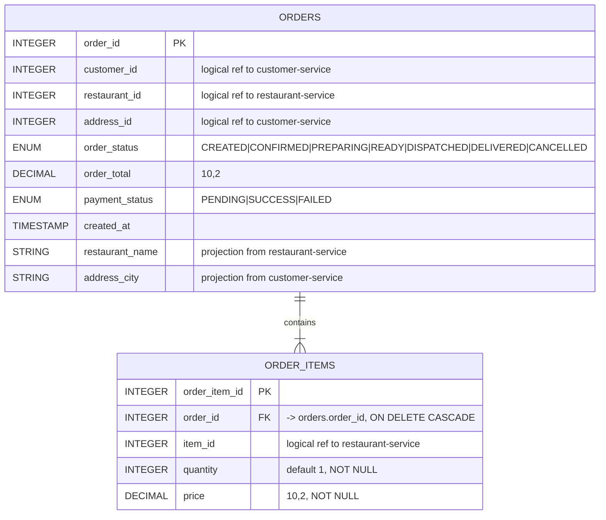

# Order Service — ER Diagram

**Database:** `order_db` (PostgreSQL via Sequelize)
**Tables:** `orders`, `order_items`

## Keys & constraints

| Table | PK | FK | NOT NULL | Enums |
|---|---|---|---|---|
| `orders` | `order_id` | — | `customer_id`, `restaurant_id`, `address_id`, `order_status`, `order_total`, `payment_status` | `order_status`, `payment_status` |
| `order_items` | `order_item_id` | `order_id` → `orders.order_id` **CASCADE** | `order_id`, `item_id`, `quantity`, `price` | — |

## Integrity

- **Intra-service FK:** `order_items.order_id` → `orders.order_id` with `ON DELETE CASCADE` (declared in `OrderItem.js`).
- **Transactions:** Order + its items are inserted inside a single Sequelize transaction (`order.service.js` `sequelize.transaction`), so partial orders cannot be persisted.
- **Status machine:** `VALID_TRANSITIONS` in `order.service.js` enforces `CREATED → CONFIRMED → PREPARING → READY → DISPATCHED → DELIVERED`, with `CANCELLED` reachable from any pre-dispatch state.
- **Pricing invariant:** `order_total = round(subtotal + subtotal*0.05 + 30, 2)`; mismatch with client total → `TOTAL_MISMATCH` 400.

## Cross-service references (logical, no DB FK)

| Column | Owning service | Used for |
|---|---|---|
| `customer_id` | customer-service | ownership check at order-create |
| `address_id` | customer-service | delivery target; projected `address_city` |
| `restaurant_id` | restaurant-service | open/closed + menu-item checks; projected `restaurant_name` |
| `order_items.item_id` | restaurant-service | price/availability lookup per item |

## Replicated read models (projections)

Captured at order-create time so later reads don't require cross-service calls:
- `orders.restaurant_name` — snapshot of `restaurant.name`
- `orders.address_city` — snapshot of `address.city` (drives same-city rule in delivery-service)

These are intentionally **not refreshed**: they represent the order's view of the world at the moment it was placed.

## Published facts (consumed by others)

- Order existence + `payment_status` → payment-service `charge()` flow.
- Order + `restaurant_id` + `address_city` → delivery-service `assign()` for the same-city rule.
- `order_id`, status events → notification-service via async HTTP fire-and-forget.
